# Proiect C++ - Aplicație de Management Hotelier

## Descriere generală
Această aplicație C++ rulează în consolă și oferă funcționalități pentru gestionarea completă a unui hotel: de la clienți și camere, până la rezervări. Proiectul este bazat pe Programare Orientată pe Obiect și are două categorii principale de utilizatori: **Recepționer** și **Administrator**.

<p align="center">
  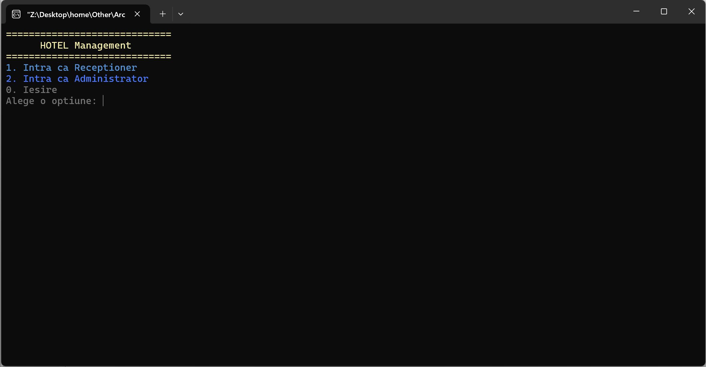
  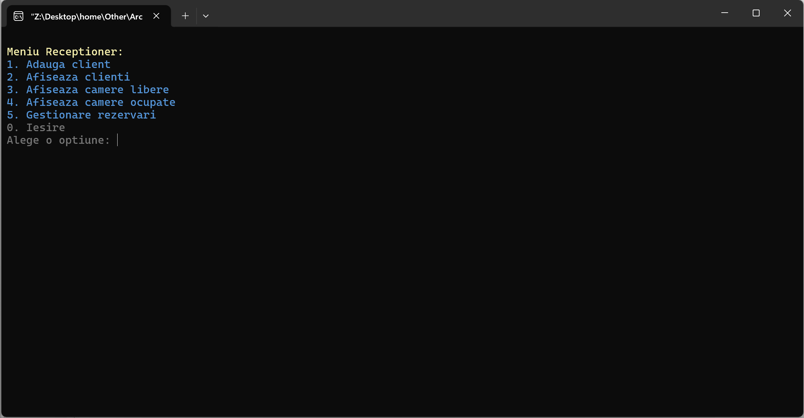
  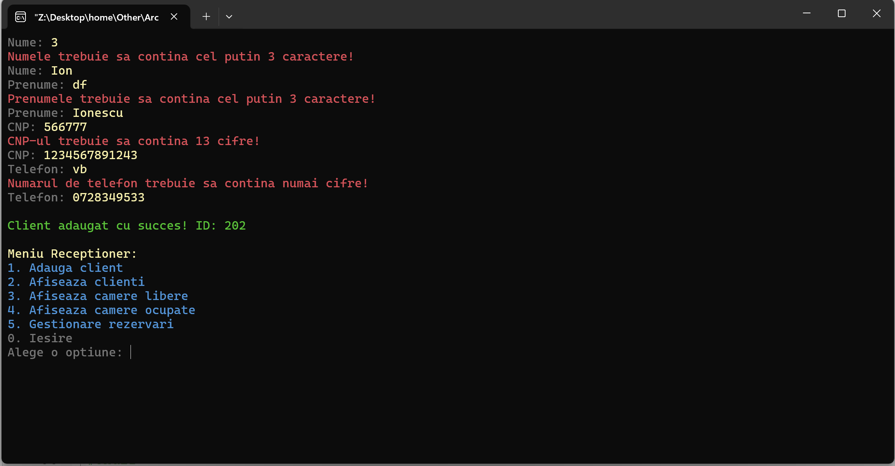
  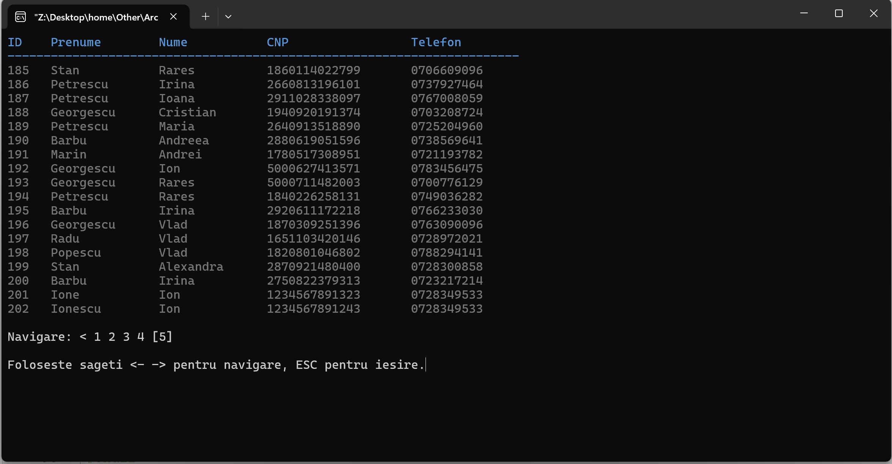
  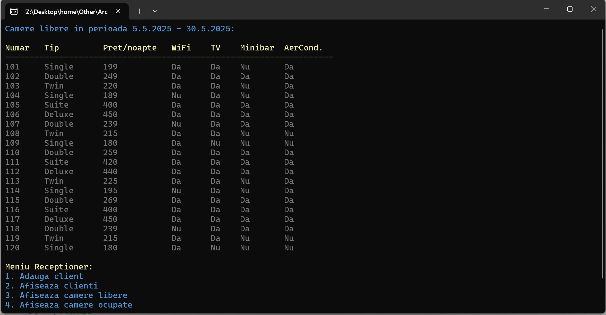
  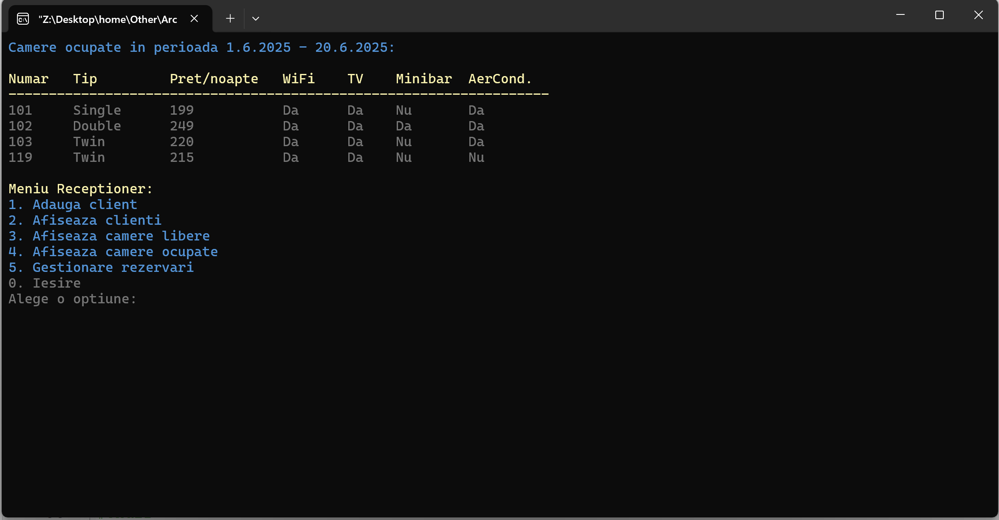
  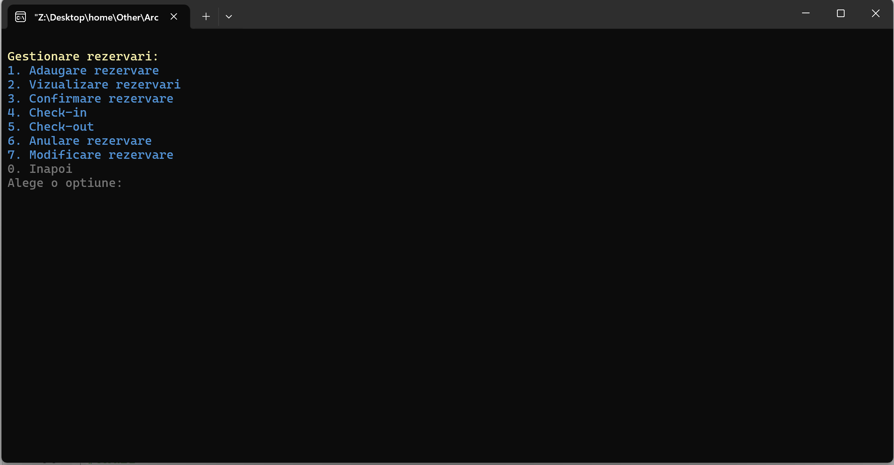
  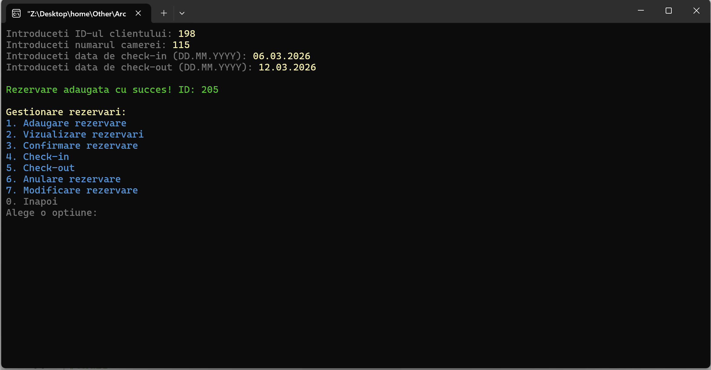
  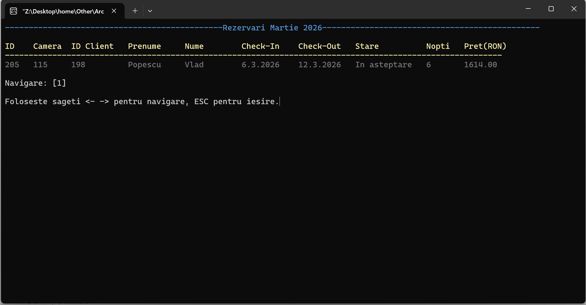
  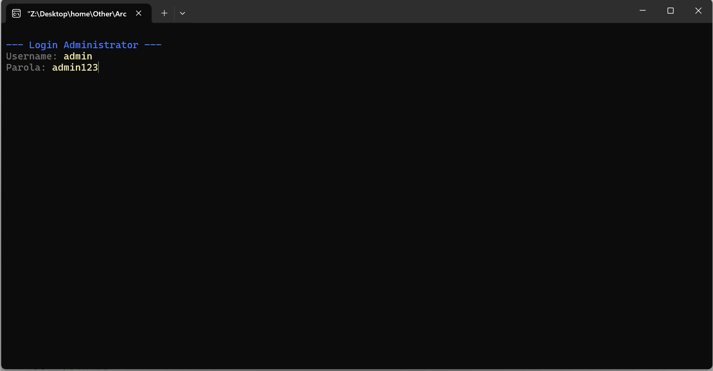
  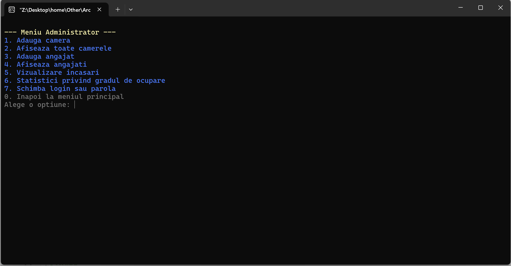
  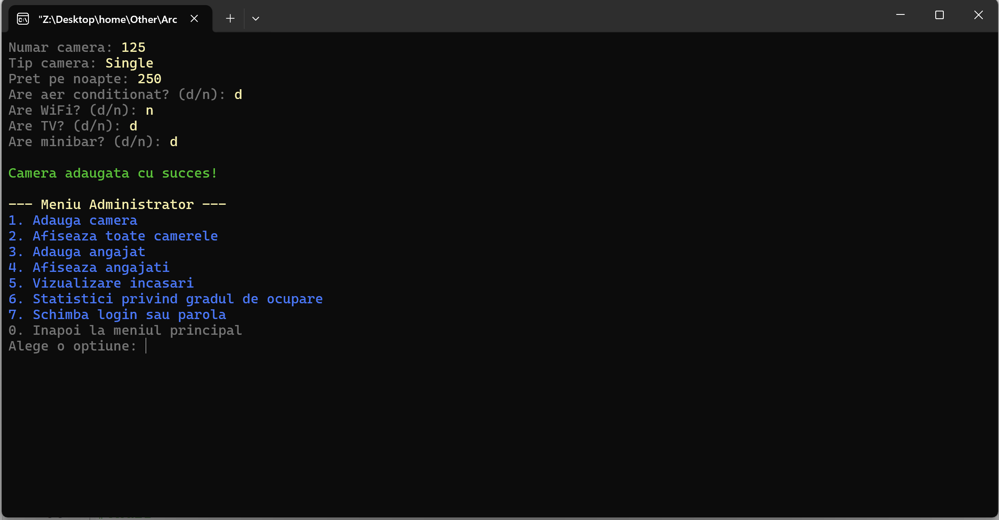
  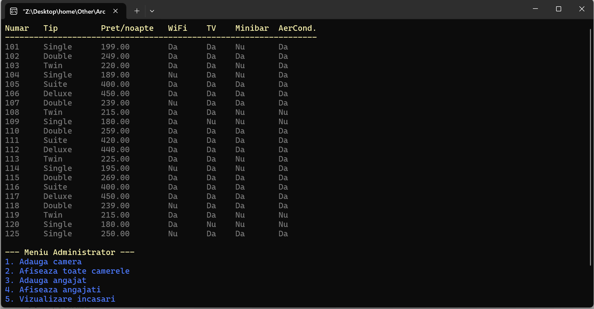
  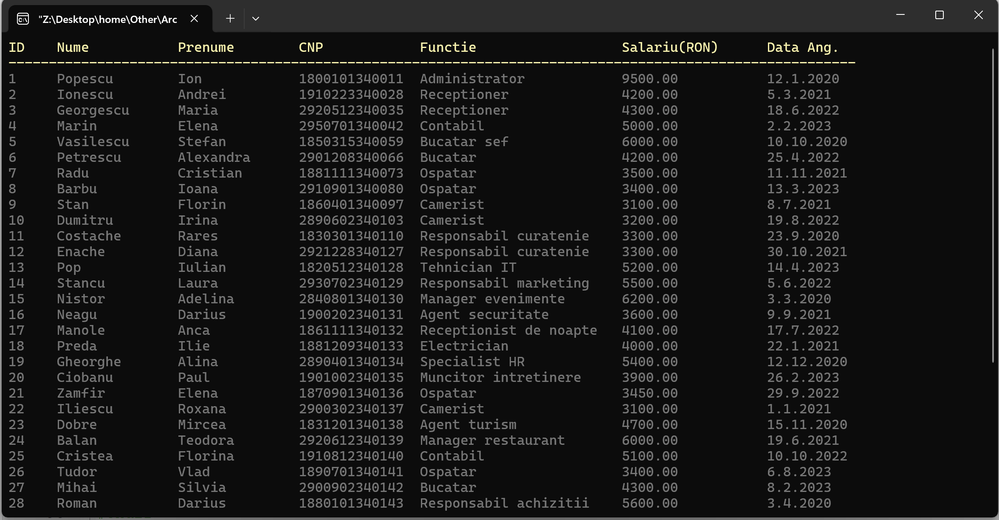
  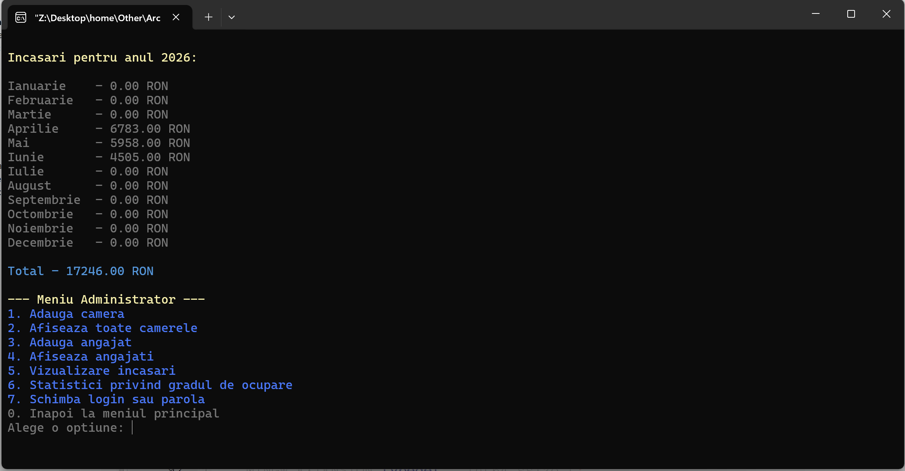
  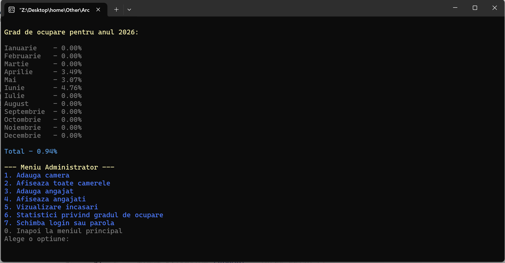
  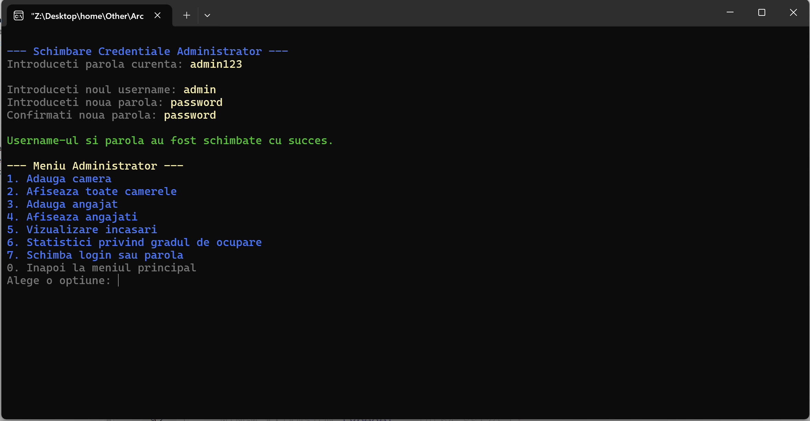
</p>

## Categorii de utilizatori

### Recepționer
- Adaugă clienți noi
- Vizualizează lista clienților
- Vizualizează camere libere/ocupate
- Gestionează rezervări:
  - Adăugare rezervare
  - Confirmare rezervare
  - Check-in
  - Check-out
  - Anulare rezervare
  - Modificare rezervare
  - Vizualizare rezervări

### Administrator
- Adaugă camere noi
- Vizualizează toate camerele existente în sistem
- Adaugă angajați noi
- Vizualizează lista angajaților
- Vizualizează încasările pe lună și anual
- Afișează statistici privind gradul de ocupare
- Schimbă login sau parolă

## Structura fișierelor

| Fișier               | Descriere                                                              |
| -------------------- | ---------------------------------------------------------------------- |
| `main.cpp`           | Punctul de intrare în aplicație                                        |
| `Hotel.h / .cpp`     | Clasa principală care gestionează clienții, camerele și rezervările    |
| `Client.h / .cpp`    | Clasă pentru reprezentarea și manipularea clienților                   |
| `Camera.h / .cpp`    | Clasă care definește o cameră de hotel                                 |
| `Rezervare.h / .cpp` | Clasă pentru rezervări, cu stări și metode de gestiune                 |
| `Administrator.h / .cpp` | Clasă pentru gestionarea funcționalităților Administratorului        |
| `Angajat.h / .cpp`   | Clasă pentru reprezentarea și manipularea angajaților                  |
| `Data.h / .cpp`      | Clasă pentru gestionarea datelor calendaristice                        |
| `clienti.txt`        | Fișier text cu date despre clienți (ID, nume, prenume, CNP, telefon)   |
| `camere.txt`         | Fișier text cu informații despre camere (număr, tip, preț, facilități) |
| `rezervari.txt`      | Fișier text care păstrează toate rezervările și starea lor curentă     |
| `angajati.txt`       | Fișier text cu date despre angajați (ID, nume, prenume, CNP, funcție, salariu, data angajării) |
| `admin_creds.txt`    | Fișier text cu credentialele administratorului (username, parolă criptată) |

## Cum rulezi aplicația

1. Asigură-te că ai un compilator C++ instalat (ex: `g++`).
2. Compilează proiectul:

   ```bash
   g++ main.cpp Hotel.cpp Client.cpp Camera.cpp Rezervare.cpp Administrator.cpp Angajat.cpp Data.cpp -o hotel_app